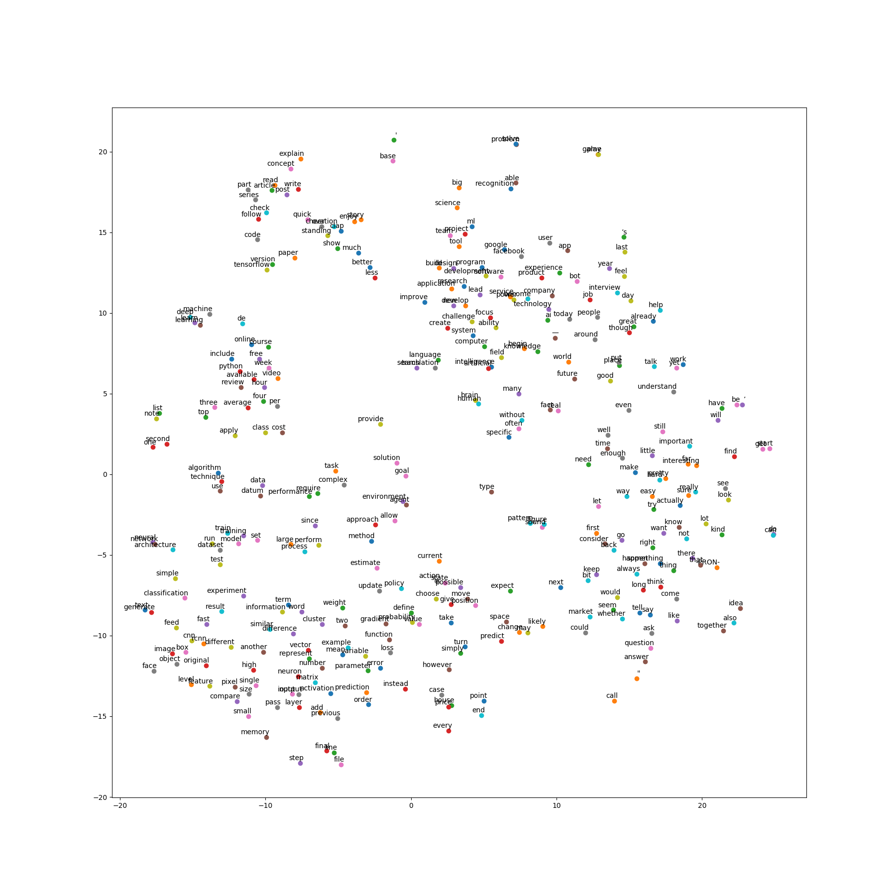

# Word2Vec Embeddings & t-SNE

## Description

This project aims to extract the text from the <a href="https://www.kaggle.com/hsankesara/medium-articles">Medium Articles</a>, create a <a href="https://www.pydoc.io/pypi/gensim-3.2.0/autoapi/models/word2vec/index.html">Gensim's Word2Vec Model</a> and analyse the relationships between words in the high dimensional corpus using <a href="https://scikit-learn.org/stable/modules/generated/sklearn.manifold.TSNE.html">Sklearn's TSNE Module</a>.

## Word2Vec & t-SNE Introduction

The deep learning models designed for Natural Language Processing domain require the text data in numeric form (though some of them nowadays have their own internal word embedding processes and just requires you to pass the text as it is). But the overall idea is to trainform the textual data into numbers that the models understand.

`Word2Vec` is a way to represent similar words in similar numeric form. This ensures that a high dimensional data could be transformed into a much lower dimension. This way similar words are near each other (in the same neighborhood) as their word vectors are also similar. In this project, Word2Vec model is used for <a href="https://pypi.org/project/gensim/">Gensim</a> library.

`t-Distributed Stochastic Neighbor Embedding (t-SNE)` is a dimentionality reduction technique just like PCA or TruncatedSVD but with a slightly different approach. Imagine there are two distributions, one which measures the pairwise similarities between the actual input points and another which measures the pairwise similarities between low dimensional input points in the word embeddings. But the approach is computationally expensive.

In this project, this technique is used to visualize the high dimensional word vectors to identify similar words in a clustered form.

## Get the Data.

The <a href="https://www.kaggle.com/hsankesara/medium-articles">data</a> used in this project is a Kaggle dataset.


## How to run?

Get the libraries listed in the `requirements.txt` and run the command below.

```
python word2vec_tsne.py
```

Basically, this script reads the data and gets specifically the text present in the `text` column.

Then, minor preprocessing is done like lowercasing, removing words like `[something]` and the words which contain numbers in them, and removes all the special charatcters.

The words are then lemmatized to their root form and corpus of documents is created.

The word embeddings are created using `Word2Vec` model. I used all but one cores of my system in doing this. While training the Word2Vec model, you can play around with the hyperparametrs like min_count, window, size, workers, etc. These parameters basically define the number of occurrences of the word, the distance between the actual word and the predictions, the number of cores to use and the size of the feature vectors.

`t-SNE` is used to plot the models vocabulary (limited) so associations between words could be analyzed.

## Interesting Observations

If you look at the image (`tsne_plot_word2vec.png`) created after the program execution, you would notice clusters of words with semantic similarities.



Example, there is cluster with words - `"neural"`, `"network"`, and `"architecture"`, another cluster with words - `"machine"`, `"deep"`, `"learning"`, and `"learn"`.

It is a great way to identify semantic similarities between words in the corpus and looking at the results, it actually makes sense from a human perspective.

## References and Sources

Thanks to the authors of these articles!

1) <a href="https://towardsdatascience.com/understanding-word2vec-embedding-in-practice-3e9b8985953">Understanding Word2vec Embedding in Practice</a> (TowardsDataScience Article).
2) <a href="https://towardsdatascience.com/visualising-high-dimensional-datasets-using-pca-and-t-sne-in-python-8ef87e7915b">Visualising high-dimensional datasets using PCA and t-SNE in Python</a> (TowardsDataScience Article).
